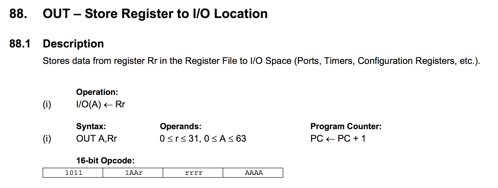

+++
author = "Michael Spieler"
title = "AVR programming in hex"
slug = "avr-prog"
date = "2015-08-02"
tags = ["embedded"]
+++

In this post I describe how I built a working program for an AVR directly in hex without using a C compiler or assembler.
This is not directly useful, but it helps to understand how assembly instructions are represented
and translated into binary.

# assembly program

This is a simple example program which sets PB5 (the LED on Arduino Pro Mini) to output and toggles it in an infinite loop.

~~~
    ldi r16, 0x20
    out DDRB, r16   // set PB5 to output
loop:
    out PINB, r16   // toggle PB5
    ldi r17, 0xff
wait:
    dec r17
    brne wait

    rjmp loop
~~~

# translate to binary

The instruction encoding is defined in the [AVR Instruction Set Manual](http://www.atmel.com/images/atmel-0856-avr-instruction-set-manual.pdf)
and the register addresses you find in the register summary of the AVR's datasheet.

To give an example, let's look at the line `out DDRB, r16`. The instruction is defined as follows:

Just take the 16bit opcode `1011 1AAr rrrr AAAA` and insert `r = 0x10` (r16) and `A = 0x04` (DDRB), which gives `1011 1001 0000 0100` or `0xb904` in hex.

The whole program translated to binary:

~~~
asm                 bin                     hex
ldi r16, 0x20       1110 0010 0000 0000     e200
out 0x04, r16       1011 1001 0000 0100     b904
out 0x03, r16       1011 1001 0000 0011     b903
ldi r17, 0xff       1110 1111 0001 1111     ef1f
dec r17             1001 0101 0001 1010     951a
brne -2             1111 0011 1111 0001     f7f1
rjmp -5             1100 1111 1111 1011     cffb
~~~

# write a hexfile

For flashing with avrdude, the program needs to be in the [intel HEX](https://en.wikipedia.org/wiki/Intel_HEX)
format.

~~~
:[Data Size] [Start Address] [Record Type] [Data] [Checksum]
~~~
which gives:

~~~
:0e 0000 00 00e204b903b91fef1a95f1f3fbcf [Checksum]
~~~
(Note that instructions are stored in little endian byte order which means
that the LSbyte comes first.)

At the end there is a 1 byte checksum which is simply the two's complement of sum of all bytes (inclusive size, address, record type).
Just calculate the sum (0x0e + 0x00 + 0x00 ... = 0x7d8), reduce it to the least
significant byte (0xd8) and apply the two's complement, which gets you a checksum of 0x28.

With adding a terminating line with a record type 'End Of File' (0x01) you get the hexfile:

~~~
:0e00000000e204b903b91fef1a95f1f7fbcf28
:00000001FF
~~~

# flashing

I flashed it on an Arduino Pro Mini (ATMega328) using a FTDI USB to serial adapter with avrdude.

~~~
avrdude -c arduino -P /dev/tty.MYFTDI -b 57600 -p atmega328p -D -U flash:w:MYPROGRAM.hex:i
~~~
