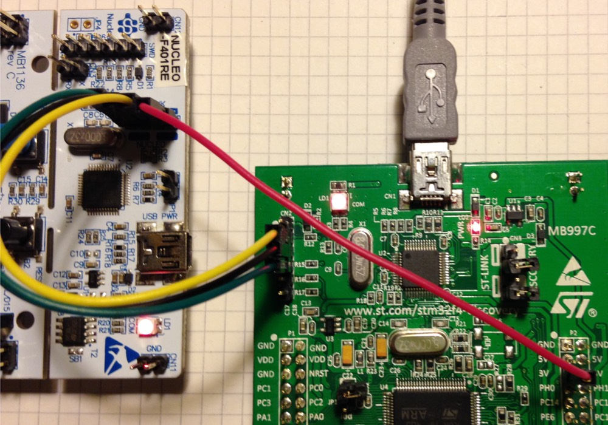

+++
author = "Michael Spieler"
title = "Flashing blackmagic firmware on ST-Link"
slug = "blackmagic-stlink"
date = "2015-08-24"
tags = ["Embedded"]
image = "blackmagic-stlink-wiring.jpg"
+++

The [Black Magic Probe](http://www.blacksphere.co.nz/main/blackmagic) is a great alternative firmware for the ST-Link which comes with STM32 Discovery and Nucleo devboards.
It offers a direct debugger interface for gdb, which removes the need for openocd in the middle.

I noted the steps for myself to reproduce the procedure of flashing the blackmagic probe firmware on a ST-Link using openocd.

# Build
Get the source (commit ef574b72b14e10c964f1aa73348d3048f88d1029).


$ git clone https://github.com/blacksphere/blackmagic.git
$ cd blackmagic
$ cd libopencm3/
$ make lib
$ cd ../src/
$ make PROBE_HOST=stlink


# Wiring
First desolder the four solder bridges from 'DEFAULT' and solder the 'RESERVED'.
Connect SWD form a second ST-Link to the 4-pin jumper of the target (order: VCC, SWCLK, GND, SWDIO)

# Flash
openocd config file openocd.cfg:

~~~
telnet_port 4444
source [find interface/stlink-v2.cfg]
transport select hla_swd
source [find target/stm32f1x_stlink.cfg]
~~~

start openocd:

$ openocd -f openocd.cfg


From another shell, connect to openocd and unlock, erase and flash the ST-Link:


$ telnet localhost 4444
Open On-Chip Debugger
> init
> reset halt
> stm32f1x unlock 0
> stm32f1x mass_erase 0
> flash write_bank 0 blackmagic.bin 0x2000
> flash write_bank 0 blackmagic_dfu.bin 0


# Run

~~~
$ arm-none-eabi-gdb firmware.elf
(gdb) target extended-remote /dev/tty.foobar
Remote debugging using /dev/tty.foobar
(gdb) mon swdp_scan
Target voltage: unknown
flash size 32768 block_size 1024
Available Targets:
No. Att Driver
 1      STM32F04
(gdb) attach 1
Attaching to Remote target
0x08000468 in ?? ()
(gdb) load
...
(gdb) run
...
~~~

Here you go. You can break apart the nucleo board to get a nice, little debugger.

There should also be a second tty, which is the UART adapter (on pins PA2=TX, PA3=RX).

Sources:

- [http://www.blacksphere.co.nz/main/blackmagic]()
- [http://wiki.paparazziuav.org/wiki/STLink]()
- [http://embdev.net/articles/STM_Discovery_as_Black_Magic_Probe]()
